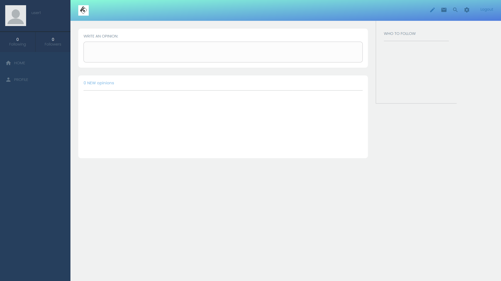
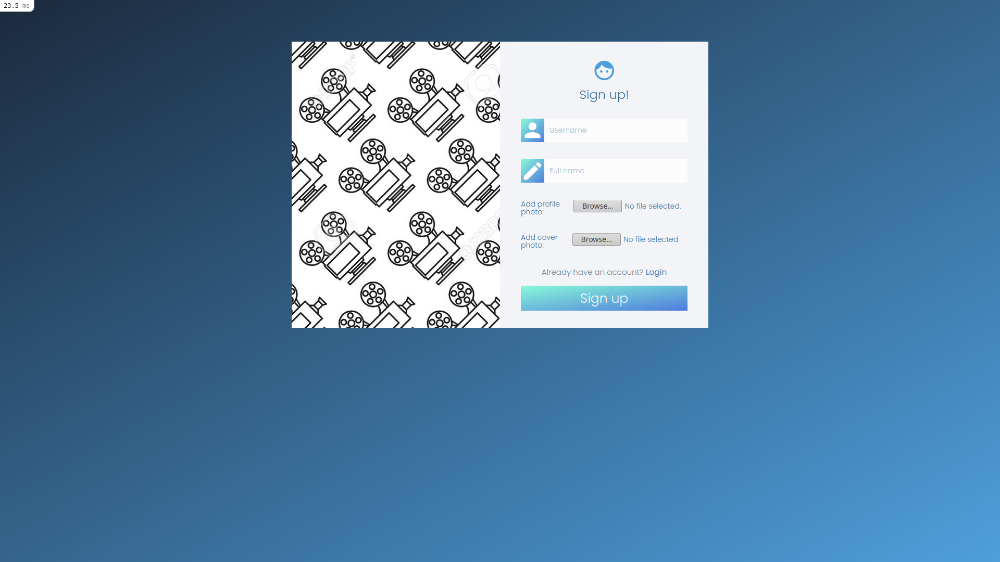
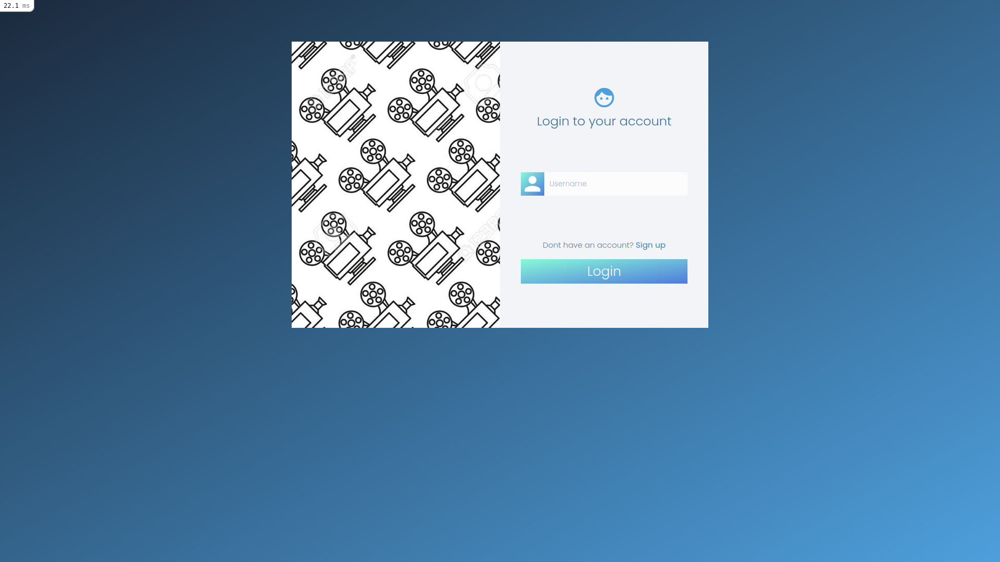
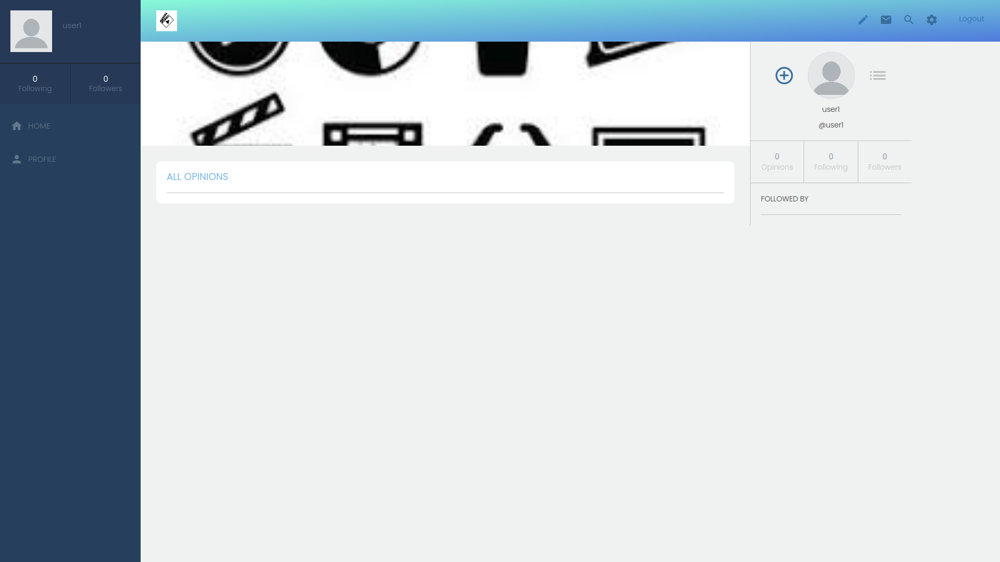
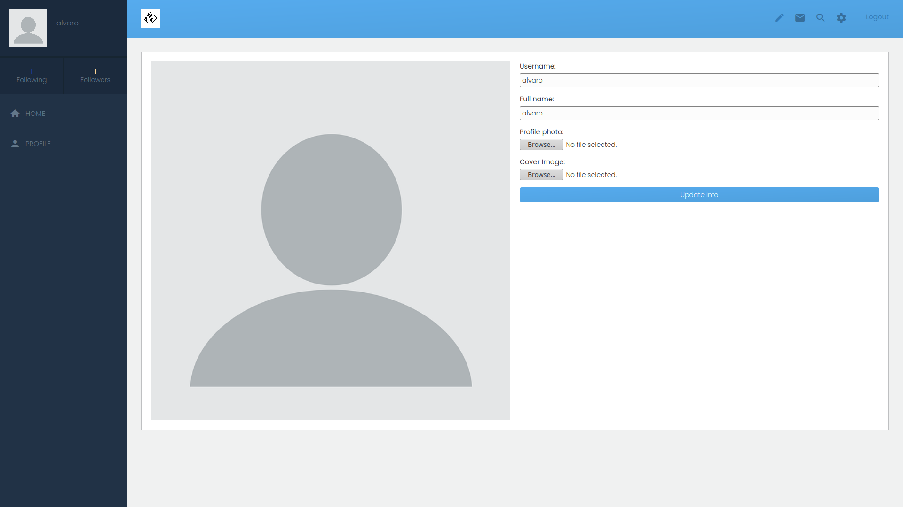

## Movie Review app

> Welcome to my Movie Review web application. This project was built with `Ruby on Rails` and `PostgreSQL` in the back-end and `Sass` in the front-end. `Rspec` was used in the testing phase and `Heroku` was used for deployment.

# Home page


# Sign up page


# Sign in page


# User profile page


# Edit profile page


## Built With

- Ruby v2.7.2
- Ruby on Rails v6.1.3
- Rspec
- Linux
- Sass
- PostgreSQL

## Live Demo


## Getting Started

To get a local copy up and running follow these simple example steps.

### Prerequisites

Ruby: 2.7.2
Rails: >=6.1.3
Postgres: >=9.5

### Setup

Instal gems with:

```
bundle install
```

Setup database with:

```
   rails db:create
   rails db:migrate
```

### Usage

Start server with:

```
    rails server
```

Open `http://localhost:3000/` in your browser.

### Run tests

```
    rpsec --format documentation
```

## Author

👤 **Alvaro Ruiz**

- Github: [@alvarorf](https://github.com/alvarorf)
- Twitter: [@aaruizf](https://twitter.com/aaruizf)
- Linkedin: [Álvaro Ruiz](https://www.linkedin.com/in/alvaro-andr%C3%A9s-ruiz-florez/)

